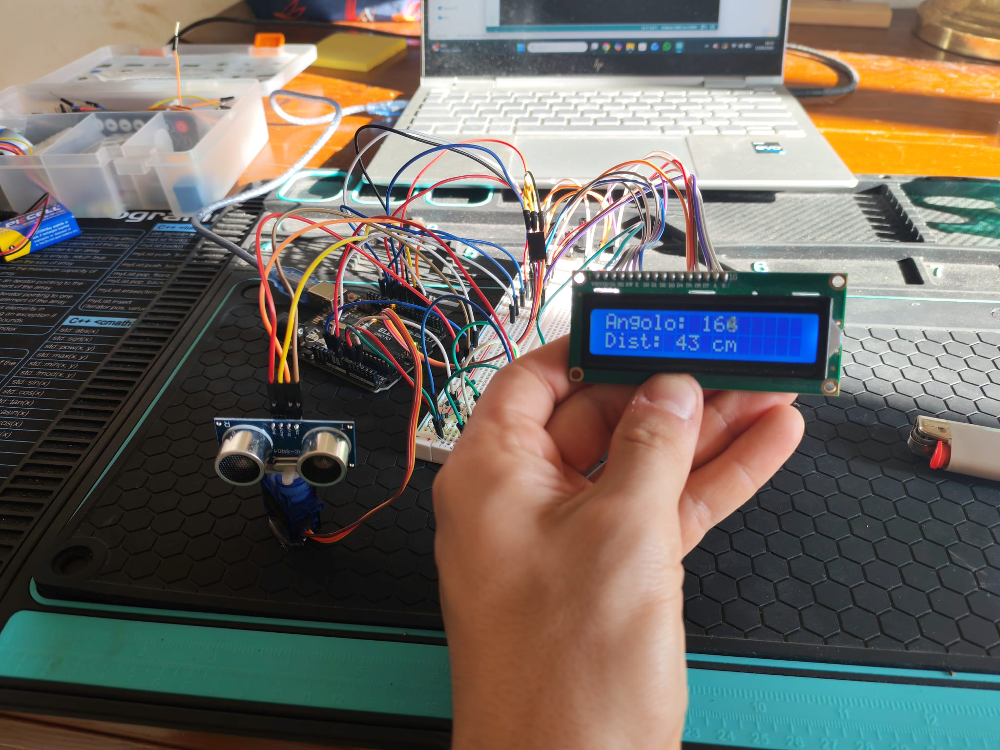
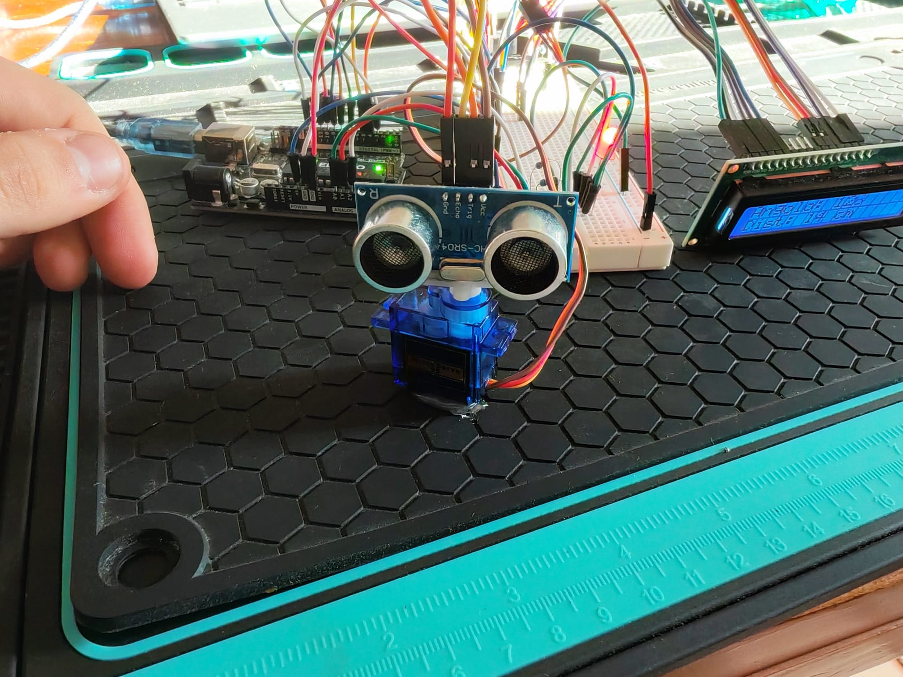
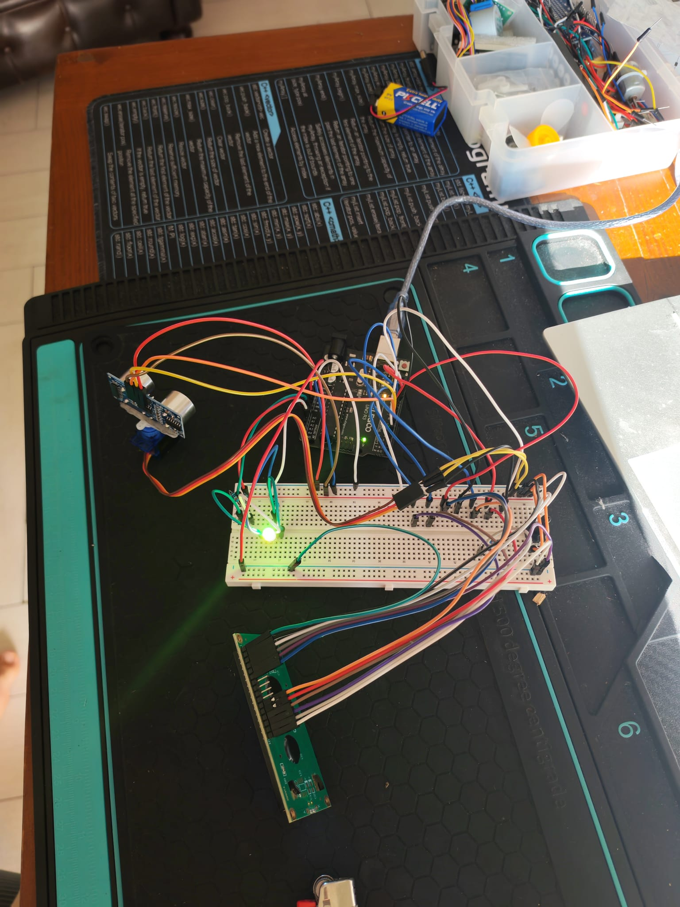

# Arduino Radar Scanner

## Overview
Questo progetto implementa un semplice **radar a scansione** utilizzando:
- Sensore a ultrasuoni **HC-SR04**
- Servo motore **SG90**
- Display **LCD 16×2** in modalità 4 bit
- Microcontrollore **Arduino Uno**

Il sensore viene ruotato tramite il servo tra 0° e 180° per misurare la distanza degli oggetti e visualizzarla sull’LCD.  
Il progetto simula i principi base dei sistemi radar reali (scansione, acquisizione dati, visualizzazione).

---

## Funzionalità principali
- Rotazione automatica del sensore tramite servo
- Misura continua della distanza
- Visualizzazione dei dati su LCD 16x2
- Scansione con passo angolare configurabile
- Struttura estendibile per logging e analisi dati

---

## Hardware utilizzato
- **Arduino Uno**
- **HC-SR04** (sensore ultrasuoni)
- **SG90** (servo motore)
- **LCD 16×2** (modalità 4 bit)
- Potenziometro 10k (per il contrasto del display)
- Jumpers e breadboard
- Supporto meccanico per il montaggio

---

## Immagini del progetto

---

## Come funziona
1. Il servo ruota da 0° a 180°.
2. A ogni step il sensore HC-SR04 misura la distanza.
3. L’LCD mostra valore misurato e angolo corrente.
4. Terminata la scansione, il servo ritorna indietro.

---

## Possibili estensioni
- Invio dati al PC via seriale
- Plot stile radar in Processing / Python
- Esportazione CSV
- Filtri per rendere le misure più stabili
- Aggiunta di un allarme per distanze inferiori a una soglia

---

## Licenza
Open-source — libero uso per studio e prototipazione.
